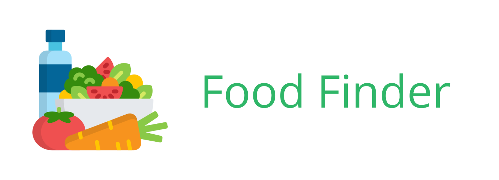
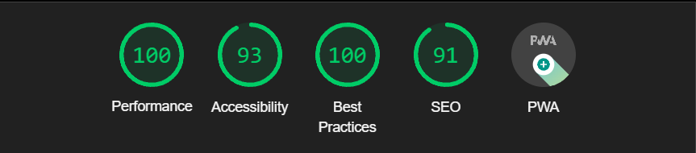

# ⚙ [Food Finder PWA](https://healthyfoodfinderpwa.herokuapp.com/)


## 📂 Assignment
The assignment is to convert the SPA that we made ([Food-Finder-SPA](https://github.com/KoenHaagsma/Food-Finder-SPA)) into a Progressive web app, also adding service worker to turn it into a PWA, finally we need to add performance optimalisations.

## 🧾 Table of contents
-   [About the project](##About-the-project)
      * [Built with](###Built-with)
      * [Features](###Features)
      * [Checklist](###Checklist)
      * [Wishlist](###Wishlist)
      * [Performance](###Performance)
      * [API](###API)
-   [Activity Diagram](##Activity-Diagram)
-   [Getting started](##Getting-started)
      * [Installation](##Installation)
-   [Packages/Dependecies](##Packages/dependecies)
      * [Dependecies](##Dependecies)
      * [Dev dependecies](##Dev-dependecies)
-   [License](##License)

## 📖 About the project
The project is about building a Progressive web app from the previous SPA we made. ([Food-Finder-SPA](https://github.com/KoenHaagsma/Food-Finder-SPA)) We also needed to keep in mind the performance of the app, my performance report is below here at [📈 Performance](###Performance).

### 🛠 Built with
The project is built with Node.js, Express and Pug, also some smaller npm packages were added also seen below here at [Packages/Dependecies](##Packages/dependecies)

### 🌟 Features
- Scanning a product, it is possible for the user to scan a product bar code with the application, when the scanning is done and the product is recognised the application will show a detail paga with all info that you would expect from a product detail page.
- Searching for a product code, it is also possible for the user to search on a product bar code, I created this because something the scanner can fail and then there is the possibility to find the product a different way.
- Searching for a product (category), it is possible for the user to search for a product with only the product name, there is a small disclaimer here because the API searches on category, this means that you need to search in plural most times. Check the [MoSCoW](###MoSCoW) for how i would have done it another way if i had time.
- Detail page and last but not least the app has a detail page where users can see if the product is healthy or not, it shows the nutritional grade and most nutritional values per 100gr, also an image of the product is provided.

### ✔ Checklist

### 🔮 Wishlist

### 📈 Performance


### 🔁 API
The API used in this product is: [Healthy Food Checker - Open Food Facts API](https://world.openfoodfacts.org/files/api-documentation.html). The API has a lot of data about all foods that you can think off, you can search on different categories, products, barcodes etc.
There is a lot more possible than that I knew until the last week of the project, I see a lot of possibilities that would enhance my application a lot more, I can still do this and I will do, check the [MoSCoW](###MoSCoW) for more information on what I still want to built.

## ✴ Activity Diagram

## 🔍 Getting started
*Before you can start you need to follow the installation*

## 🔨 Installation
1. Open the terminal, or use the terminal in your IDE

2. Clone the repository
```
git clone https://github.com/KoenHaagsma/Food-Finder-PWA.git
```
3. Go to the cloned repository
```
cd ../../Food-Finder-PWA
```
4. Install all packages
```
npm install || npm i
```
5. Start the application for development
```
npm run dev
```
6. Open de server and go to the browser: [Localhost:8000](http://localhost:8000/). If this doesn't work change your port to another port

### 🧱 Dependecies
- [compression](https://www.npmjs.com/package/compression)
- [dotenv](https://www.npmjs.com/package/dotenv)
- [express](https://www.npmjs.com/package/express)
- [pug](https://www.npmjs.com/package/pug)
- [node-fetch](https://www.npmjs.com/package/node-fetch)

### 🧱 Dev dependecies
- [nodemon](https://www.npmjs.com/package/nodemon)
- [minify](https://www.npmjs.com/package/minify)


## 📑 Sources

## 🔖 License
[]()
