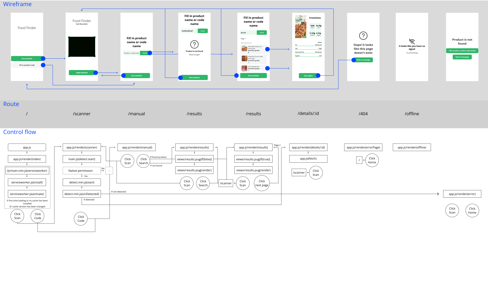

# ⚙ [Food Finder PWA](https://healthyfoodfinderpwa.herokuapp.com/)


## 📂 Assignment
The assignment is to convert the SPA that we made ([Food-Finder-PWA](https://github.com/KoenHaagsma/Food-Finder-PWA)) into a Progressive web app, also adding service worker to turn it into a PWA, finally we need to add performance optimalisations.

### Assignments
- [Assignment 1](https://github.com/KoenHaagsma/Food-Finder-PWA/wiki/Exercise-1)
- [Assignment 2](https://github.com/KoenHaagsma/Food-Finder-PWA/wiki/Exercise-2)
- [Assignment 3](https://github.com/KoenHaagsma/Food-Finder-PWA/wiki/Exercise-3)

## 🧾 Table of contents
-   [About the project](##About-the-project)
      * [Built with](###Built-with)
      * [Features](###Features)
      * [Checklist](###Checklist)
      * [Performance](###Performance)
      * [API](###API)
      * [MoSCoW](###MoSCoW)
-   [Activity Diagram](##Activity-Diagram)
-   [Getting started](##Getting-started)
      * [Installation](##Installation)
-   [Packages/Dependecies](##Packages/dependecies)
      * [Dependecies](##Dependecies)
      * [Dev dependecies](##Dev-dependecies)
-   [License](##License)

## 📖 About the project
The project is about building a Progressive web app from the previous SPA we made. ([Food-Finder-SPA](https://github.com/KoenHaagsma/Food-Finder-SPA)) We also needed to keep in mind the performance of the app, my performance report is below here at [📈 Performance](###Performance).

### 🛠 Built with
The project is built with Node.js, Express and Pug, also some smaller npm packages were added also seen below here at [Packages/Dependecies](##Packages/dependecies)

### 🌟 Features
- Scanning a product, it is possible for the user to scan a product bar code with the application, when the scanning is done and the product is recognised the application will show a detail paga with all info that you would expect from a product detail page.
- Searching for a product code, it is also possible for the user to search on a product bar code, I created this because something the scanner can fail and then there is the possibility to find the product a different way.
- Searching for a product (category), it is possible for the user to search for a product with only the product name, there is a small disclaimer here because the API searches on category, this means that you need to search in plural most times. Check the [MoSCoW](###MoSCoW) for how i would have done it another way if i had time.
- Detail page and last but not least the app has a detail page where users can see if the product is healthy or not, it shows the nutritional grade and most nutritional values per 100gr, also an image of the product is provided.

### ✔ Checklist
Checklist for showing what is done and what still can be done.<br>
- [x] Scanning a product
- [x] Show the details of a product
- [x] Alternative way of searching for a product
- [x] Fast way of searching for a product
- [x] Service Worker
- [x] Performance optimising
- [ ] Sorting list of searched products
- [ ] Detailed loading states
- [x] Easy experience with finding a product
- [x] 404 if hash is not found
- [ ] Lazy loading products if last product is reached
- [ ] Loading state when needed
- [x] Details on the detail page are useful
- [ ] Alternative way provided if scanning takes to long
- [ ] Buttons not clickable when nog needed
- [ ] Sort on popularity
- [ ] Sort on kcal
- [ ] Sort on nutritional grade
- [ ] Compare products
- [ ] Alternative healthier product showed for searched product
- [ ] Add products to a list
- [ ] Show products that are added to the list


### 📈 Performance
<br>
How did i achieve this score:
- Service worker with static and dynamic caching
- Adding caching header
- Compression middleware
- Minifing CSS, JS

### 🔁 API
The API used in this product is: [Healthy Food Checker - Open Food Facts API](https://world.openfoodfacts.org/files/api-documentation.html). The API has a lot of data about all foods that you can think off, you can search on different categories, products, barcodes etc.
There is a lot more possible than that I knew until the last week of the project, I see a lot of possibilities that would enhance my application a lot more, I can still do this and I will do, check the [MoSCoW](###MoSCoW) for more information on what I still want to built.


### 🙌 MoSCoW
**Must have**
- Users must be able to scan a product;
- Users must be able to view the details of a product;
- Users must be able to view useful details of a product on the detail page;
- Users must have an alternative way to search for a product instead of scanning;
- Users must have a fast way to scan/search (for) a product;
- Users must have a way to see if the app is loading.

**Should have**
- Users should have an easy experience with finding a product;
- Users should have another alternative showed if the scanning of a product takes too long;
- Users should have a way to sort on more categories than the app sorts on now;
- Users should not be able to click buttons that do nothing yet;
- Users should have a way to see if a button is clickable or not;
- Users should have a way to sort the list of searched products;

**Could have**
- Users could have a way to compare products to eachother;
- Users could have a way to add products to a list;
- Users could have a way to show added products.

**Won't have**
- Users won't have a way to register in the app;
- Users won't have a way to login to the app;
- Users won't have a way to scan with the native Barcode API.

## ✴ Activity Diagram


## 🔍 Getting started
*Before you can start you need to follow the installation*

## 🔨 Installation
1. Open the terminal, or use the terminal in your IDE

2. Clone the repository
```
git clone https://github.com/KoenHaagsma/Food-Finder-PWA.git
```
3. Go to the cloned repository
```
cd Food-Finder-PWA
```
4. Install all packages
```
npm install || npm i
```
5. Start the application for development
```
npm run dev
```
6. Open de server and go to the browser: [Localhost:8000](http://localhost:8000/). If this doesn't work change your port to another port

### 🧱 Dependecies
- [compression](https://www.npmjs.com/package/compression)
- [dotenv](https://www.npmjs.com/package/dotenv)
- [express](https://www.npmjs.com/package/express)
- [pug](https://www.npmjs.com/package/pug)
- [node-fetch](https://www.npmjs.com/package/node-fetch)

### 🧱 Dev dependecies
- [nodemon](https://www.npmjs.com/package/nodemon)
- [minify](https://www.npmjs.com/package/minify)

## 🔖 License
[]()
